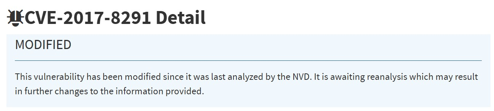
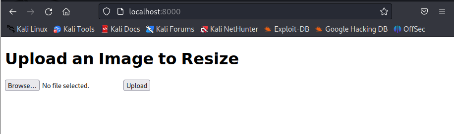
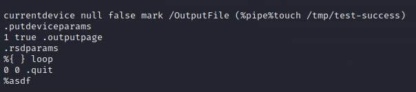
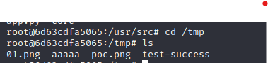

# 实验报告

## 漏洞类型

- Ghostscript CVE-2017-8291
  

## 实验环境

- kali 2023
- docker-compose
- vulhub


## 实验步骤

### 环境搭建

利用kali虚拟机，安装docker-compose，搭建vulhub环境

```bash
git clone https://github.com/vulhub/vulhub.git
```

- 进入对应漏洞目录

  ```bash
  cd vulhub/python/PIL-CVE-2017-8291
  ```

- 环境搭建

  ```bash
  docker-compose up -d
  ```

- 在浏览器里访问靶场，链接为https://localhost:8000/，也可以是https://<kali-ip>:8000/

    

- 准备一个`exp.png`，用vim打开`exp.png`可以看到如下内容，在`%pipe%`后的内容会被执行

  

- 在浏览器上传`exp.png`，在docker靶场中可以查看到相应文件，证明漏洞存在

  

### 参考链接

[CVE-2017-8291](https://github.com/vulhub/vulhub/tree/master/python/PIL-CVE-2017-8291)